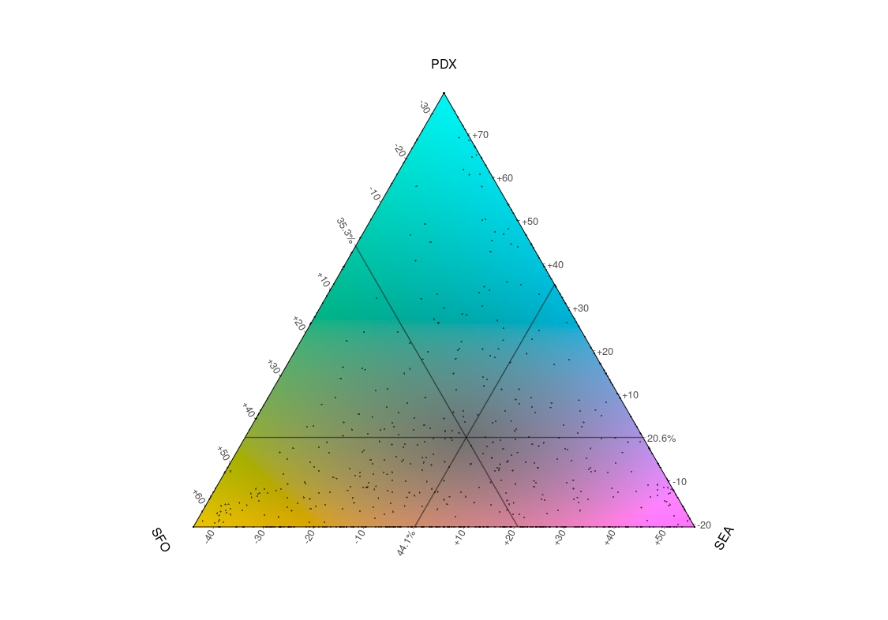

Up today: a brief little mapping exercise in leaflet for R, combined with htmlwidget's `saveWidget` function that allows users to create a simple map in leaflet, compile it to HTML and upload onto the web.

The topic of the map is the ACS County-to-County migration models, specifically filtered to show migration to Seattle, Portland, and San Francisco. I also wanted to use the very cool "tricolore" package that allows you to create ternary choropleth maps that can depict combinations of three different variables (in this case, the percentages of migrants moving to the three different metros).

It's not a typical choropleth, and takes people a minute to break down what they're looking at. Putting a ternary legend in a leaflet webmap is kinda hacky and I don't really like the mechanics of it, so I'd rather, for the purposes of this post, just stick it outside where you can gander at it while you click around the webmap.

<iframe width="100%" height="500" src="../c2c_map.html" frameborder="0"></iframe>
                       
