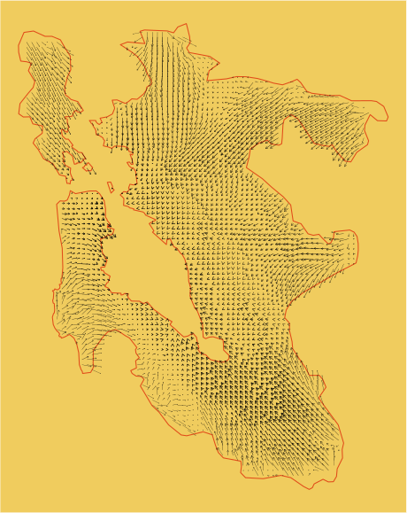

Just a quick post today to show some progress on another R mapping hobby project - rendering LODES data in the style of a wind vector map. In essence, trying to elicit the broad directional patterns of worker commutes across a metropolitan region - in this case, San Francisco.  

